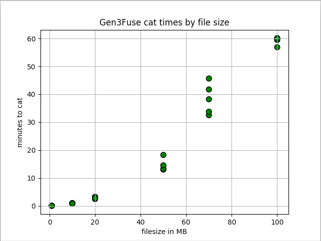
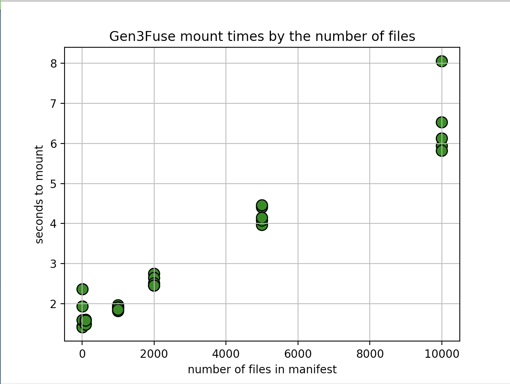
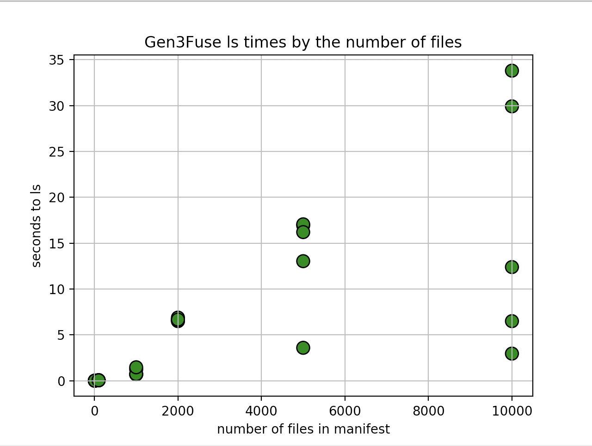

# gen3-fuse

gen3-fuse is a FUSE implementation built on [jacobsa/fuse](https://github.com/jacobsa/fuse) that serves files hosted in s3 as if they were stored locally. 

We use the [Workspace Token Service](https://github.com/uc-cdis/workspace-token-service) to login to [Fence](https://github.com/uc-cdis/fence), which provides temporary signed URLs to access files stored in s3. This allows the end-user to natively browse files stored in s3 without access to AWS credentials.

## Overview

The gen3fuse program is initialized with a manifest file from a Gen3 Data Commons and a mount point. The Workspace Token Service authenticates the worker node by checking Kubernetes annotations on the machine. Access tokens can then be retrieved from the WTS for use with Fence to obtain presigned URLs.

A manifest.json file contains a list of pointers to data objects stored in s3. It may serve as a cohort of subjects that a researcher
would like to perform analysis on in her workspace.

    [
        {
            "uuid": "7612",
            "subject_id": "10",
            "object_id" : "fbd5b74e-6789-4f42-b88f-f75e72777f5d",
        },
        ...
    ]

This program manipulates file system [inodes](http://www.linfo.org/inode.html) so that the mount point is populated with a directory containing "files" listed in the manifest. When a specific file is opened for reading (OpenFile), the temporary signed URL for that DID is obtained from Fence and stored in memory. When the file is read (ReadFile) the contents at the presigned URL is fetched and delivered to the user. 

## Setup

Clone this repository into your $GOPATH, which might be `~/go/src` or `/usr/local/go.` 
If you're a Mac user, you may need to install [OSXFUSE](https://github.com/osxfuse/osxfuse/releases) before you run the setup below.

Before running this program, you'll need the Workspace Token Service running at some URL, as Gen3Fuse uses that service to authenticate.
If you'd prefer to mock this service for testing purposes, see the testing section below.

You can choose where errors are logged in the yaml config file. By default they are logged to /dev/stdout in production (config.yaml) and ./fuse_log.txt in development (local-config.yaml). To setup and mount a directory:
    
    # Clone
    git clone https://github.com/uc-cdis/gen3-fuse.git
    cd gen3-fuse/

    # Build
    go build

    # Run (note the fields you need to fill in)
    ./gen3fuse  <path to config yaml file> <path to manifest json file> <directory to mount>

Note the usage of the program above. You provide the yaml configuration file on the command line. In the repo, there are example yaml configs already completed.
For a Kubernetes deployment into a Jupyter pod, config.yaml may be appropriate. To run Gen3Fuse on your own computer, local-config.yaml might be useful.
    
To safely unmount Gen3Fuse for any reason:
    
    fusermount -u <mounted directory>

Note that Gen3Fuse will make an Unmount call on the mount point provided to it before it mounts the directory. 

## Running unit tests and mocking the Workspace Token Service

If you want to test this program locally, you can use the resources in the tests/ folder to mock the Workspace Token Service.

First obtain an api key from your commons, at the /identity endpoint.

Then, in one terminal window, run:

    go build tests/mock_wts_server.go
    ./mock_wts_server <commons url> <api key>

The mock workspace token service should now be running at localhost:8001. The yaml file you pass in should set this as the Workspace Token Service base url (local-config.yaml is set up to work with this pattern).

If you've already performed the Gen3Fuse setup instructions listed above, you can just run the following in a separate window:

    go test tests/gen3fuse_test.go

## Performance tests
Below are the results of a set of performance tests. Each chosen x axis value was tested 5 times, the results are shown in the scatter.

Tests were run at an internet connection speed of 30.6 Mbps (3.825 MB/s) download, 2.07 Mbps (0.25875 MB/s) upload. 
Performance can clearly be improved. A 100MB file should take 26 seconds to download at this throughput, but takes an hour to 
cat or cp using FUSE. 

The fuse logs show that a ReadFile call is performed more than once per cat operation; this may indicate 
that files are re-requested when read times are long. Such a problem could be addressed with the addition of per-file mutex locks.

Another bottleneck is the logic of the ReadFile function. We can improve performance by parallelizing byte read operations and exploring partial downloads for 
the tail and head operations using the HTTP Range header. 

